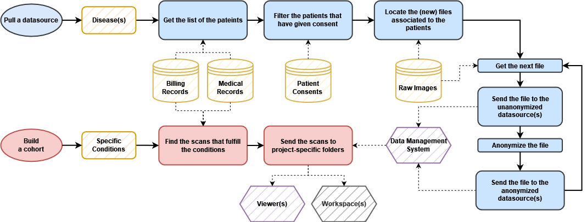

## Explanation

**Useful links**:
[Discovery (FHV)](http://soinsrv01.fhv.ch/login) |
[Discovery (FHV) queues](http://10.128.24.77:7000/) |
[SLIMS (FHV)](http://sfhvbiob01/slims/login)

Cohort Builder is the main data preparation pipeline of the data science group
of the Jules-Gonin hospital.
The general aim of the software is to programmatically extract medical scans and patient data
from databases and image pool servers, treat the files, anonymize them, upload them to an external
web-based software (RetinAI Discovery), and download the images and analyses in a configurable way.
The final results will be used by other projects to train deep learning networks or test specific
scientific hypotheses.

---

<center></center>

---

The above figure shows an overview of the pipeline and the interactions with external sources at each
step. The external sources at the Jules-Gonin hospital are:

- Billing Records: Opale databases
- Medical Records: MediSIGHT databases
- Patient Consent: SLIMS database
- Raw Images: Heyex servers
- Data Management System: RetinAI Discovery
- Viewer: RetinAI Discovery
- Workspace: Swiss Ophthalmic Image Network (SOIN)

---

<center></center>

---

The above figure shows the detailed flowchart of the pipeline.
The pipeline is comrpised of two main parts: *pulling* and *building*.

## Usage

The full documentation is available at `T:\Studies\CohortBuilder\docs\`.

### Docker image

1. Clone this repository
2. [Install docker](https://www.docker.com/get-started/), and launch [the systemd service](https://www.digitalocean.com/community/tutorials/how-to-use-systemctl-to-manage-systemd-services-and-units).
3. Run `docker build .`
4. Check the hash of the image you just built with:
```{bash}
docker image ls
```
5. Run the docker image with, for example:
```{bash}
docker run --name <ANY_IMAGE_NAME> -v <YOUR_SETTINGS_LOCATION>:/cohortbuilder/cohortbuilder/settings.json:ro -v <YOUR_KEYS_LOCATION>:/cohortbuilder/keys.json:ro <IMAGE_HASH> [COMMAND_LINE_OPTIONS]
```
You can add in the `--rm` option to automatically remove the container created by the previous command once the program exits.

### Direct usage

1. Clone this repository
2. Install the [miniconda package manager](https://docs.anaconda.com/free/miniconda/)
3. Build the environment ([make sure that `conda` is in your path](https://www.digitalocean.com/community/tutorials/how-to-view-and-update-the-linux-path-environment-variable)):
```{bash}
conda env create -f environment.yml -y -n cb
```
4. Run `cohortbuilder`. (You must be in the folder where you cloned the repo in your terminal. [Check with pwd.](https://phoenixnap.com/kb/pwd-linux))
```{bash}
conda run -n cb python run.py [COMMAND_LINE_OPTIONS]
```