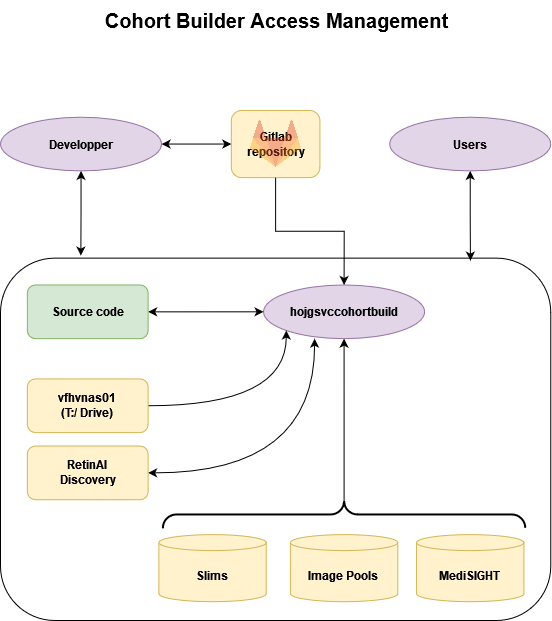

.. _serverdev:

sfhvcohortbuilder01
=====================================

Here you can find details about configurations made on the server.

----------------------------------
User Administration
----------------------------------

Certain ADI users (regular users on the hospital's network) have access
to ``sfhvcohortbuilder01`` with their corresponding credentials.
Among these is the ``hojgsvccohortbuild`` user which is the service user
of Cohort Builder on the hospital's network. This user is used for granting
the necessary accesses for Cohort Builder, like access to MediSIGHT or mounting
the necessary file systems.

.. note::

    ``ADI\hojgsvccohortbuild`` is different from the local ``cohortbuilder`` user,
    which is used by all the group members to connect to the server.

.. note::

    Note that there is a mismatch between the username of ``hojgsvccohortbuild``
    and the address of its mailbox: ``hojgsvccohortbuilder@fa2.ch``.

There are two local groups for managing the users on the server.
The ``cb`` group grants access to using Cohort Builder and related files.
The ``conda`` group grants access to users for using the shared conda installation
discussed in the next section.

---------------------------

---------------------------

----------------------------------
Conda
----------------------------------

Conda is installed in ``/opt/miniconda3/envs/cb/bin/python`` and can be
used by all the users in the local ``conda`` group.

Cohort Builder uses the ``cb`` environment, located in ``/opt/miniconda3/envs/cb/``.
This environment should always kept synced with the ``environment.yml`` file.

.. _serverbackup:

----------------------------------
Back-up of ``/cohortbuilder/``
----------------------------------

The :ref:`server hosting Cohort Builder <server>` does not have automatic back-up.
In case of storage loss, the files in ``/cohortbuilder/cohortbuilder``
and ``/cohortbuilder/cohortbuilder-dev`` can be restored from the GitLab repository.
However, the rest of the files might be lost.
To avoid this, it is advised to do a manual backup once in a while by taking the steps below:

.. code:: bash

    rsync -r --delete --exclude=cohorts /cohortbuilder/ /mnt/vfhvnas01/HOJG/Studies/CohortBuilder/server-backup/
    echo Backup of sfhvcohortbuilder:/cohortbuilder/ -- $(date '+%a %Y-%m-%d %H:%M') > /mnt/vfhvnas01/HOJG/Studies/CohortBuilder/server-backup/readme.txt

.. note::

    Since the Cohort Builder server is not mounted on ``T:/Studies``, the only way for accessing
    the documentation from ``T:/Studies`` is by copying it from the server.
    Manual backups also contain the documentations.
    Hence, by taking the steps above the documentation will also be updated.

----------------------------------
Bash configurations
----------------------------------

Global bash configurations are managed in ``etc/bashrc``.

- The ``cb`` and ``cb-dev`` aliases are defined to make running
  Cohort Builder easier.

- The path of the installation of the SQL driver is also added to the
  system paths.

----------------------------------
Mounting file systems
----------------------------------

The configurations of the necessary file systems are added to ``/etc/fstab``.
This file reads ``/etc/cifs_credentials`` to fetch the credentials of the
``hojgsvccohortbuild`` user which has access to the file systems.

The file systems listed in ``/etc/fstab`` will automatically be mounted on
system setup.
In case of problems, they can be unmounted and remounted with the following
commands:

.. code:: bash

    sudo umount -a;
    sudo mount -a;
