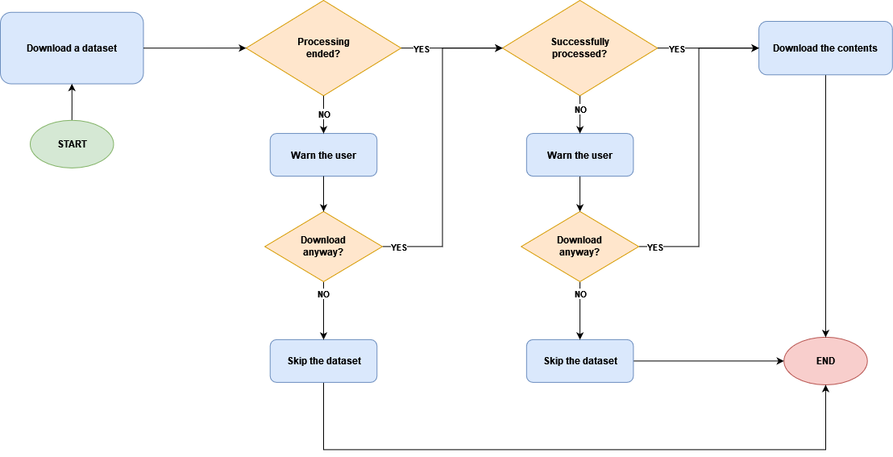

.. _build:

Build
=======================================

The building process can be started by the ``build`` subcommand.

The below figure presents the flowchart of the process of downloading
a dataset from :ref:`discovery`.

----------------------------

----------------------------

Before building a cohort from one or more workbooks, make sure that their files have been
successfully processed by Discovery using the :ref:`reprocess` subcommand.

---------------------------------------
Usage
---------------------------------------

In this section you can see a typical usage of this command.
For more detailed descriptions, please refer to :ref:`cli` or simply enter the following command:

.. code:: bash

    cb build --help

The following command builds a cohort from the "CSCR" and "GA" workbooks on the
"DATASOURCES" project on the "fhv_research" :ref:`Discovery instance <discovery_instances>`,
based on the :ref:`configurations <buildconfigs>` set in ``.../configs/<your-user-name>/custom_configs.json``.

.. code:: bash

    cb build -i fhv_research -p DATASOURCES -w CSCR GA --configs custom_configs.json

After the process is finished, you will find the downloaded cohort in the default directory
for cohorts (modifiable in :ref:`settings`).
You can change the path of the cohorts for a single process by passing the ``--cohorts_dir`` argument.

.. _buildconfigs:

---------------------------------------
Configuration File
---------------------------------------

In order to launch the Build process, you need to specify your configurations
in a ``.json`` file in the ``.../configs/<your-user-name>/`` folder. You can start by making a copy
of ``template-configs-build.json``.
Currently, the default configurations folder is ``T:/Studies/CohortBuilder/configs``.
It is possible to temporarily change the configurations folder for one process by passing the
``--configs_dir`` argument.

.. note::

    The configuration file needs to be located in a folder under the username of the active user,
    hence, ``.../configs/cohortbuilder/``

The structure of the file should be the same as the template file.
Each field of the configuration file is documented in the following.
In :ref:`"general" <buildconfigs_general>`, the general configurations of the run are set.
In :ref:`"types" <buildconfigs_types>`, the file types that are desired to be downloaded are set.
In :ref:`"patients" <buildconfigs_filters>`, optionally, some filters can be set on different levels.
If you do not intend to set any filters, leave the default values in these sections.

.. _buildconfigs_general:

general
~~~~~~~~~~~~~~~~~~~~~~~~~~~~~~~~~~~~~~~

*string* ``name``
    The name of the cohort. A folder with this name will be created in
    the directory of the cohorts.

*bool* ``metadata``
    If ``true``, the raw metadata of the unfiltered objects will be stored on
    each workbook's folder in a file named ``patients.json``.

    .. note::

        These files might grow large for large workbooks.

*bool* ``taxonomy``
    If ``true``, additional taxonomy will be applied on the scans and the process
    will take much longer. Consider turning it off if you do not need to filter
    the entities based on taxonomies other than the ones that are present in Discovery.

    .. warning::

        The taxonomy functions are not maintained for now. Even if this configuration
        is set to ``true``, no classification will be carried out.

*string* ``copy_filtered_workbook``
    The UUID of the target workbook for uploads. If set, the filtered objects
    will be imported to this workbook. Set to ``null`` if you do not intend
    to upload them to any workbook.

*bool* ``reidentify_modality``
    Whether or not to re-identify the modalities of downloaded DICOM files, as their
    metadata is often stripped of these values by Discovery. The identified modality will
    be written into a file, at the same level as the DICOM itself. 

.. _buildconfigs_types:

types
~~~~~~~~~~~~~~~~~~~~~~~~~~~~~~~~~~~~~~~

*bool* ``oct``
    If ``true``, OCT (cube, line, star, etc.) images will be downloaded.

*bool* ``fundus``
    If ``true``, fundus images (enface view) will be downloaded. This also
    includes the fundus image that might be available in OCT datasets.

*bool* ``thumbnail``
    If ``true``, the thumbnail of the datasets (``.svg`` file),
    if available, will be downloaded.

*bool* ``segmentation``
    If ``true``, the segmentations, if available, will be downloaded.

*bool* ``biomarkers``
    If ``true``, the biomarkers (``.json`` file), if available, will be downloaded.

*bool* ``thicknesses``
    If ``true``, the thicknesses (``.json`` file), if available, will be downloaded.

*bool* ``volumes``
    If ``true``, the volumes (``.json`` file), if available, will be downloaded.

*bool* ``rawimages``
    If ``true``, the raw images that are usually missing the laterality will be downloaded.
    If the laterality is set in the filters, these images won't be downloaded even if this configuration is ``true``.

*bool* ``ecrf``
    If ``true``, the ECRF forms will be downloaded.

*bool* ``pdf``
    If ``true``, the PDF files will be downloaded.

*bool* ``projection_images``
    If ``true``, the projection images will be downloaded.

*bool* ``thickness_images``
    If ``true``, the thickness images will be downloaded.

*bool* ``h5``
    If ``true``, the h5 files will be downloaded.

*bool* ``dicom``
    If ``true``, the parent files that are in the DICOM format will be downloaded.

*bool* ``e2e``
    If ``true``, the parent files that are in the ``.e2e`` format will be downloaded.

*bool* ``fda``
    If ``true``, the parent files that are in the ``.fda`` format will be downloaded.

.. _buildconfigs_filters:

filters
~~~~~~~~~~~~~~~~~~~~~~~~~~~~~~~~~~~~~~~

patients
+++++++++++++++++++++++++++++++++++++++

*list* [*string*] ``ids``
    The list of the patient IDs that are intended.

    Set to ``null`` to disable.

*string* ``birthdate_inf``
    The minimum birthdate of the patients in the ``%Y-%m-%d`` format.

    Set to ``null`` to disable.

*string* ``birthdate_sup``
    The maximum birthdate of the patients in the ``%Y-%m-%d`` format.

    Set to ``null`` to disable.

*list* [*string*] ``sex``
    The list of the genders (``M`` for male, ``F`` for female, ``O``
    for other, ``U`` for unknown) that should be included.
    For instance, setting it to ``["M", "F", "O"]`` will exclude the patients
    for which the gender is not available.

studies
+++++++++++++++++++++++++++++++++++++++

*list* [*string*] ``uuids``
    The list of the study UUIDs that are intended.

    Set to ``null`` to disable.

*list* [*string*] ``variants``
    The list of the scan variants (see `src.discovery.definitions.LayerVariant`)
    that should be present in the study.
    Each element of the list has to be a string containig
    `scan variants <src.discovery.definitions.LayerVariant>`
    separated by a ``"+"`` character. If any of the combinations is not present in the study,
    it will be filtered out.
    For instance, ``"variants": ["variant1+variant3", "variant2"]`` will only keep the studies
    that have at least one dataset with both ``variant_1`` and ``variant_3`` and one
    dataset with ``variant_2``.

    Set to ``null`` to disable.

*string* ``date_inf``
    The minimum date of the studies in the ``%Y-%m-%d`` format.

    Set to ``null`` to disable.

*string* ``date_sup``
    The maximum date of the studies in the ``%Y-%m-%d`` format.

    Set to ``null`` to disable.

*float* ``patient_age_inf``
    The minimum age of the patient at the time of the study.

    Set to ``null`` to disable.

*float* ``patient_age_sup``
    The maximum age of the patient at the time of the study.

    Set to ``null`` to disable.

datasets
+++++++++++++++++++++++++++++++++++++++

*list* [*string*] ``uuids``
    The list of the dataset UUIDs that are intended.

    Set to ``null`` to disable.

*list* [*string*] ``variants``
    The list of the scan variants (see `src.discovery.definitions.LayerVariant`)
    that should be present in the dataset.
    Each element of the list should be a string containig scan variants
    separated by a "+" character. If neither of the combinations is present in the dataset,
    it will be filtered out.
    For instance, ``"variants": ["CFI+OCT_LINE", "OCT_CUBE"]`` will only keep the datasets
    that either have both ``CFI`` and ``OCT_LINE`` or have ``OCT_CUBE``.

    Set to ``null`` to disable.

*list* [*string*] ``laterality``
    The list of the lateralities (``L`` for left, ``R`` for right) that should be included.
    For instance, setting it to ``["L"]`` will only download the datasets that are related
    to the left eye.

    Set to ``null`` to disable.

*list* [*string*] ``device``
    The list of the imaging devices that should be included.
    For instance, setting it to ``["Triton"]`` will only download the datasets that have
    been obtained by the Triton machine.

    Set to ``null`` to disable.

*list* [*string*] ``manufacturer``
    The list of the manufacturers of the imaging devices that should be included.
    For instance, setting it to ``["Topcon"]`` will only download the datasets that have
    been obtained by the devices produced by Topcon.

    Set to ``null`` to disable.

*bool* ``invisible``
    There are some datasets that are not shown in Discovery. Setting this configuration
    to ``true`` will download them. This behaviour is rarely wanted.

---------------------------------------
Structure of A Cohort
---------------------------------------
By default the directory of the cohorts is ``T:/Studies/CohortBuilder/cohorts/``.
The default directory can be changed in the :ref:`settings` or passed by the ``--cohorts_dir`` flag.
The name of the folder of the cohort corresponds to its name given in the :ref:`buildconfigs`.

.. note::

    Your cohorts will be stored in a folder under the username of the active account
    in the cohorts folder.

The following sketch shows the hierarchy of a cohort named "230710 DRIL - Diabetic"::

    230710 DRIL - Diabetic
        ├───.downloaded
        ├───Workbook_01
        │   ├───patients.json
        │   ├───00903253 3371dbcb
        │   │   ├───2021-10-25 76cebfae
        │   │   │   ├───86c156b8
        │   │   │   │   ├───dataset.h5
        │   │   |   │   ├───info.json
        │   │   │   │   ├───parent.dcm
        │   │   │   │   ├───thumbnail.svg
        │   │   │   │   ├───children
        │   │   │   │   │   ├───biomarkers_01.json
        │   │   │   │   │   ├───thickness_01.json
        │   │   │   │   │   ├───volume_01.json
        │   │   │   │   │   └───segmentation_01
        │   │   │   │   │       ├───0000.svg
        │   │   │   │   │       ├───0001.svg
        │   │   │   │   │       ├───...
        │   │   │   │   │       ├───0256.svg
        │   │   │   │   │       └───biomarkers.json
        │   │   │   │   ├───ecrf
        │   │   │   │   │   ├───ecrf_01.json
        │   │   │   │   │   └───ecrf_02.json
        │   │   │   │   ├───fundus
        │   │   │   │   │   ├───0000.jpg
        │   │   │   │   │   └───info.json
        │   │   │   │   └───oct
        │   │   │   │       └───volume
        │   │   │   │           ├───0000.jpg
        │   │   │   │           ├───0001.jpg
        │   │   │   │           ├───...
        │   │   │   │           ├───0256.jpg
        │   │   │   │           └───info.json
        │   │   │   └───b879ff8a
        │   │   │       └───...
        │   │   └───2022-10-24 ccb3bf7f
        │   │       └───...
        │   └───00903253 d4c7341d
        │       └───...
        └───Workbook_02
            └───...

At each level, only the content of one folder is included as an example. Other folders
are similar to the example folder. There are two workbooks ("Workbook_01" and
"Workbook_02") included in the cohort. "Workbook_01" has two patients. The identifier
of the first patient is "00903253" and its UUID on Discovery starts with "3371dbcb".
There are two studies for this patient. Similarly, the date of the study and the
beginning of its UUID are indicated on the folder name. The first study has two
datasets in it: "86c156b8" and "b879ff8a"; which are again the beginning of the
UUIDs of the datasets on Discovery. The ``patients.json`` file contains the
metadata of the content of all the patients in the workbook. It can be used
for creating statistics of to check the content of a workbook without downloading
them.

The ``.downloaded`` file indicates that all the content of the folder have been
completely downloaded. Such file can be in any level and will be used in the
case that a cohort is partially downloaded, to skip the downloaded content.

The dataset ``"86c156b8"`` potentially has the listed folders and files.
Note that notall the listed items necessarily exist in a dataset.
``"dataset.h5"`` contains the pre-processed images in their original quality.
This file should be used instead of the ``.jpg`` files for training tasks
on pixel data.
``"parent.dcm"`` is the original file that got uploaded and created this
dataset. The file extension can also be ``.e2e`` or ``.fda``.
``thumbnail.svg`` shows the region of the OCT on the fundus image.
``info.json`` contains the details of the dataset including the laterality,
the model of the scanning device, and the details of the corresponding
study, patient, and workbook.
The ``"fundus"`` folder contains the fundus image and its details such as
the pixel spacings and the modality of the image.
The ``"oct"`` folder contains the OCT images. A dataset usually does not have
more than one OCT but some datasets do. There is an OCT of type ``"volume"``
in this folder which has 256 scans. The exact modality of the images and the
type of the OCT can be read from the ``"info.json"`` file.
The ``"children"`` folder contains the data that got created by the post-processing
of Discovery. The :ref:`cohort_tool` can be used to read the ``.json`` files and
store them in a more readable format. In the ``"segmentation_01"`` folder, there are
256 ``.svg`` files which correspond to the 256 frames of the OCT.
The ``"ecrf"`` folder contains all the ECRF forms of the dataset.

.. _cohort_tool:

---------------------------------------
The Tool for Reading A Cohort
---------------------------------------

The `Cohort <src.cohortbuilder.tools.cohort.Cohort>` and `CohortDataset <src.cohortbuilder.tools.cohort.CohortDataset>`
classes can be used to loop over the folders of a cohort and store its content in an object.
Optionally, the location of fovea in the OCT images and vectors of thicknesses of retinal
layers can be extracted from the segmentations.
You can follow the example of the class documentation to use these tools.
