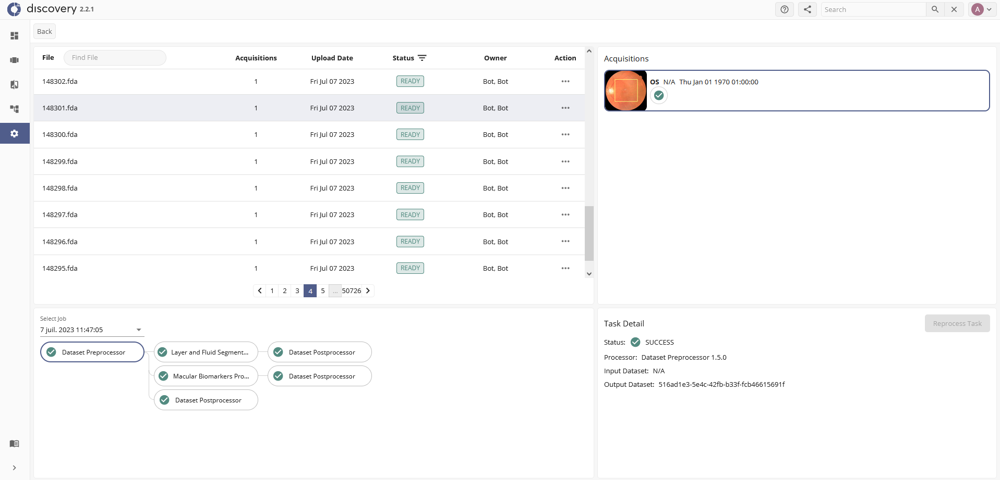
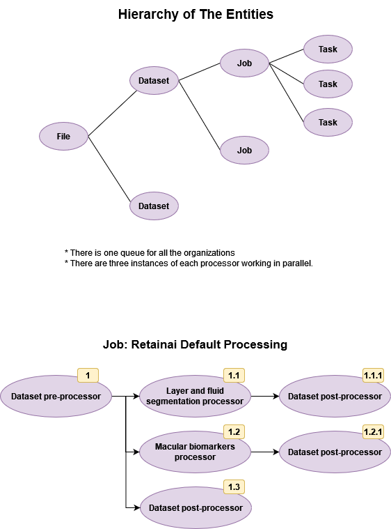

.. _discovery:

RetinAI Discovery
============================

This documentation assumes that the user is familiar with the main
concepts of Discovery such as the definition of Discovery entities
(projects, workbooks, studies, patients, and datasets),
layer and fluid segmentations, biomarkers,
`ETDRS regions`_, and how to share a workbook.
Please refer to the tutorials of Discovery in
``T:/Studies/_tutorials/Discovery/`` to get familiar with these concepts.

.. _`ETDRS regions`: https://classic.clinicaltrials.gov/ct2/show/NCT00000151

.. _discovery_instances:

Instances
----------------------------

There are two Discovery instances on the FHVi network:

- **fhv_jugo**: Contains the unanonymized files.
- **fhv_research**: Contains the anonymized files.

The files that are uploaded to one Discovery instance are not accessible
from the other instance. However, both instances share the same machines
for processing the files and thus they share the `Discovery queues`_.

.. _`Discovery queues`: http://10.128.24.77:7000/

The **soin** instance is only accessible from the SOIN workspace.

Access
----------------------------

All related workbooks (source or target) need to be shared with the Cohort
Builder account on Discovery before launching the code. Read access is enough
for :ref:`build`. For :ref:`upload` and :ref:`reprocess`,
the Cohort BUilder user needs to have write access.

In order to share a workbook with a user, it needs to be a member of the
project containing the workbook. Only admin users can change the members
of a Discovery workbook.

Files
----------------------------

When a new file is uploaded to Discovery, a UUID is attributed to the file
which is the only way to distinguish a unique file from the others because
they might have the same name. Using the UUID, the status of the file
and all of its processings can be managed from the "files" panel of
Discovery (only by admin users). The datasets that are created from a file
are called "acquisitions" and can be checked from the same panel.

If the binary content of the uploaded file matches the content of a file
that has been uploaded to Discovery before, instead of creating a new file,
the acquisitions of the old file will be referenced and will be added to the
target workbook. The file does not therefore need to be processed again.

The below figure shows the hierarchy of processing tasks of RetinAI Discovery
as well as the ordering and the default tasks. For a new file, by default,
a new job will be instantiated which contains the default tasks. If a task
fails and is reprocessed later by the user, the task and its subtasks will
be added to a new job.

