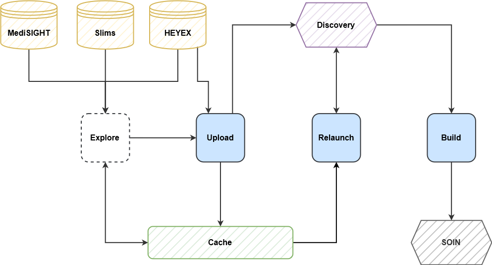
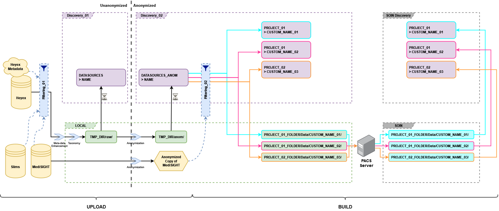

.. _gettingstarted:

Getting started
================

The pipeline is comrpised of three main parts: *upload*, *reprocess* and *build*.

----------------------------

----------------------------

The figure above shows the interactions of each subcommand with the external sources.
*Explore* is an internal functionality which is used by *upload*. It explores
MediSIGHT, SLIMS and Heyex metadata to find (and/or filter) the files that will be uploaded.

Each functionality is explained in details in what follows.

---------------------------

---------------------------

The figure above illustrates a detailed flowchart of all the steps taken in the upload and build processes.

---------------------------
RetinAI Discovery
---------------------------

Cohort Builder is built around the API of a web-based software called Discovery.
If you are new to Discovery, take a moment to briefly familiarize yourself with the main
concepts by reading :ref:`this article <discovery>`.

---------------------------
Upload
---------------------------

The first step in uploading is to pinpoint the patients that have a specific profile
(e.g., diagnosed with a certain disease) by sending SQL queries to the patient health record database
of the hospital (MediSIGHT) and filter out the ones that have not given consent to use their data by
looking at the patient consent database (Slims).

.. note::
    This part will be handled by Cohort Planner in the future. Currently, the user needs to do this part manually
    by sending a query to MediSIGHT.

The files that belong to these patients are located in the image pool servers (Heyex)
and can be copied for treatment or be uploaded.
At this step, image processing analyses could be done on the images to extract their taxonomy or other details.
Next, An anonymized version of the files are created and both versions are uploaded to one or more instances of
the :ref:`discovery` software.

---------------------------
Reprocess
---------------------------

When files are being uploaded to :ref:`discovery` using Cohort Builder, the software makes sure that all the files
are processed correctly by Discovery by relaunching the failed processes as many times as necessary.
However, in some cases, the user might be not sure whether all the data is processed correctly.
Such a situation could happen when uploading files manually or by bypassing the relaunch fuctinality of
Cohort Builder when uploading.

Downloading data from a partially processed dataset might result in losing a part of the data without noticing.
In these cases, reprocess can be used to make sure that all the scans in a Workbook are fully processed and
to relaunch the failed processes if needed. This step is always suggested before building a cohort from a workbook,
unless the user is sure about all the files being processed correctly.

---------------------------
Build
---------------------------

When a dataset is uploaded and processed on a :ref:`discovery` instance, the user picks a set of
:ref:`configurations <buildconfigs>` to filter the scans and different data types and creates a subsection of
all the data that is available on a Workbook on Discovery, corresponding to specific needs of the project.
The result is called a **cohort**. It will be downloaded and optionally be copied on another RetinAI Discovery workbook.
By building a workbook, it is possible to download everything that appears on the web interface of Discovery, and some
data that is not appeared too.

---------------------------
Server mode
---------------------------

CohortBuilder has a built-in server mode, which allows you to run jobs in the background, and automatically keep the number of threads under 80 for all active jobs. It is an optional mode, but using it is very easy. See :doc:`here <servermode>` for more info.

---------------------------
Host Server
---------------------------

Cohort Builder is hosted on a devoted server on the FHVi network.
In order to use it, first you need to connect to this server.
You can read more :ref:`here <server>`.

----------------------------
Logging
----------------------------

Whenever the program is launched, the process will be logged in a new folder for that launch
in ``/cohortbuilder/logs`` on the :ref:`server hosting Cohort Builder <server>`.
The name of the folder shows the time that the program has been launched, and its last
letter indicates the subcommand (e.g., "b" for Build).
You should keep the name of the folder in the case that in the future you find out that
something unexpected has happened. The warnings and the errors will be printed out to the
console at the end of the process.

---------------------------
Pausing the process
---------------------------

When :ref:`upload` and :ref:`reprocess` are done in batches, it is possible to pause these
processes using the ``CTRL+C`` key-combination.You always see a message about this before
this feature is activated. After pushing the key combinations, a message appears that
guarantees you that the process will be paused after finishing the current batch.
You will then be able to either stop or resume the process.

.. toctree::
    :glob:
    :maxdepth: 2
    :hidden:

    server
    discovery
    upload
    reprocess
    build
    servermode
