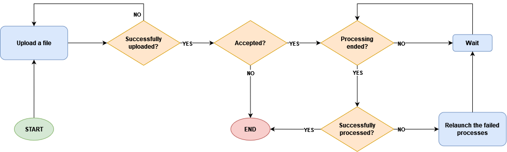
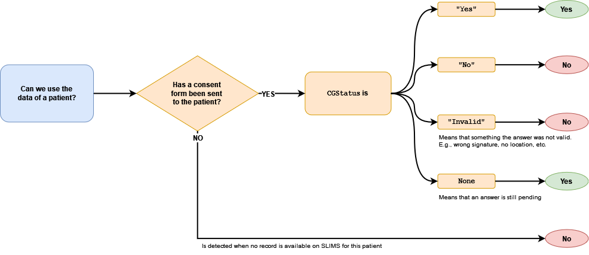

.. _upload:

Upload
=======================================

The upload process can be launched by either of the ``upload-dir`` or the ``upload-pids`` subcommands.
The former is used when we want to upload from a flat directory (without nested folders), and the
latter is used when we want to extract all the files that belong to a set of patients, by providing
their identifiers.

The figure below presents the flowchart of the process of uploading a file to :ref:`discovery`.

----------------------------

----------------------------

The figure below shows how it is decided to use the data of a patient.

----------------------------

----------------------------

---------------------------------------
Usage
---------------------------------------

In this section you can see a typical usage of this command.
For more detailed descriptions, please refer to :ref:`cli` or simply enter one of the
following commands:

.. code:: bash

    cb upload-dir --help
    cb upload-pids --help

The following command will upload the local files in a folder to the "Acute" workbook
in the "DLMA" project on both "fhv_jugo" and "fhv_research"
:ref:`Discovery instances <discovery_instances>`.
The project and the workbook have to exist on both instances.

.. code:: bash

    cb upload-dir --dir PATH_TO_FOLDER -i fhv_jugo fhv_research -p DLMA -w Acute

The following command will upload all the files that belong to patients listed
in a file ``T:\\Studies\...\patients.json`` or the patients with the identifiers
``12345678`` and ``11111111`` to the same workbooks as in the previous example.
The file has to be a json file containing a list of patient identifierst
(string or integer).

.. code:: bash

    cb upload-pids --pids 12345678 11111111 --file '/mnt/vfhvnas01/HOJG/Studies/.../patients.json' -i fhv_jugo fhv_research -p DLMA -w Acute
